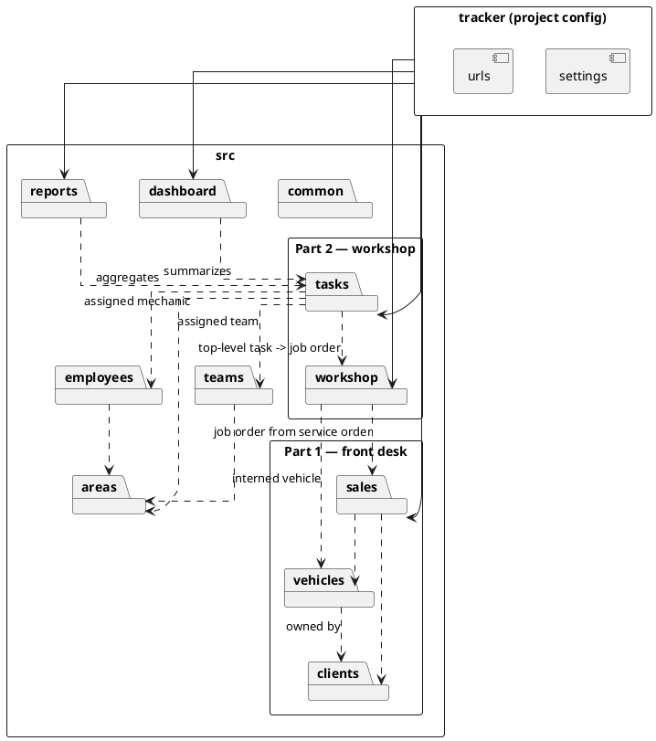

# Architecture

[← Back to README](../README.md)

This document defines the repository structure for Team Task Tracker. The goal
is to keep the repository easy to navigate while preserving Django conventions
where they prevent hidden runtime problems.

> Naming note: `tracker/` is the Django **project configuration** package.
> Domain code lives in feature modules under `src/`.

## Project layout

```text
tracker/
  settings.py
  urls.py
  asgi.py
  wsgi.py

templates/
  base.html

src/
  __init__.py
  assets/
    scss/
    ts/
  common/
  clients/      # Part 1: clients
  vehicles/     # Part 1: vehicles
  sales/        # Part 1: service orders (kept simple)
  workshop/     # Part 2: job orders
  areas/
  employees/
  teams/
  tasks/        # Part 2: tasks + subtasks
  reports/
  dashboard/

static/
  css/
  js/
  vendor/
```

- `tracker/` stays at the repository root and contains only Django project
  configuration.
- `templates/` contains global templates shared across the whole application.
- `src/` is the Python package for local Django modules and frontend source
  assets.
- `static/` contains generated, collected, or vendor static files. It is **not**
  the source of truth for app code.

## Module map



| Module      | Part | Responsibility |
| ----------- | ---- | -------------- |
| `clients`   | 1 | Clients (vehicle owners) and the client status view |
| `vehicles`  | 1 | Vehicles brought into the shop |
| `sales`     | 1 | Service orders (kept simple for now) |
| `workshop`  | 2 | Job orders for interned vehicles |
| `tasks`     | 2 | Tasks, subtasks, priority, status, the task lifecycle |
| `areas`     | — | Work areas (Mechanical, Bodywork, Paint, …) |
| `employees` | — | Employees/mechanics and their area assignment |
| `teams`     | — | Teams that can be assigned to tasks |
| `reports`   | — | Read-only aggregations ([Reports](reports.md)) |
| `dashboard` | — | The summary landing screen |
| `common`    | — | Shared mixins, validators, constants, helpers, template tags |

## Django modules

Local modules live under `src/<module_name>` and must define an explicit app
config:

```python
from django.apps import AppConfig


class AreasConfig(AppConfig):
    default_auto_field = "django.db.models.BigAutoField"
    name = "src.areas"
    label = "areas"
```

Register them in `INSTALLED_APPS` using the app config:

```python
INSTALLED_APPS = [
    "src.common.apps.CommonConfig",
    "src.clients.apps.ClientsConfig",
    "src.vehicles.apps.VehiclesConfig",
    "src.sales.apps.SalesConfig",
    "src.workshop.apps.WorkshopConfig",
    "src.areas.apps.AreasConfig",
    "src.employees.apps.EmployeesConfig",
    "src.teams.apps.TeamsConfig",
    "src.tasks.apps.TasksConfig",
    "src.reports.apps.ReportsConfig",
    "src.dashboard.apps.DashboardConfig",
]
```

Do not register local modules with bare package names like `"src.areas"`.

## Database table naming

Django's default table names use the app label plus the model name. Because
modules live under the `src` package, every local app **must** set `label`
explicitly.

Expected table names:

```text
clients_client
vehicles_vehicle
sales_serviceorder
workshop_joborder
tasks_task
```

Avoid table names like:

```text
src_areas_area
src_employees_employee
src_tasks_task
```

The `src` folder is an implementation detail of the Python package layout. It
must not leak into database table names.

## Templates

Global templates live in the root `templates/` directory:

```text
templates/base.html
templates/includes/...
templates/components/...
```

Module-owned templates live inside the owning module, under a folder named
after the app:

```text
src/areas/templates/areas/list.html
src/employees/templates/employees/list.html
src/tasks/templates/tasks/detail.html
```

The repeated app-label folder is intentional. Django template names are global
across the configured loaders; if multiple apps define `list.html` or
`form.html`, Django may resolve the wrong file depending on lookup order.
App-qualified template names avoid this:

```python
return render(request, "areas/list.html")
return render(request, "employees/list.html")
return render(request, "tasks/detail.html")
```

## Frontend assets

A hybrid asset layout is used. Shared frontend source lives under `src/assets`:

```text
src/assets/scss/
src/assets/ts/
```

Module-specific frontend source lives beside the owning module:

```text
src/tasks/assets/scss/_tasks.scss
src/tasks/assets/ts/kanban.ts
```

- Use **shared** assets for reusable UI primitives, variables, mixins, layout
  styles, and TypeScript utilities used by more than one module.
- Use **module** assets for behavior or styles that only make sense inside that
  module (e.g. Kanban drag-and-drop in `tasks`).

Compiled output goes to:

```text
static/css/main.css
static/js/
```

Do not edit compiled CSS or JS directly.

## Shared Python code

Reusable Python lives in `src/common`: model mixins, validators, constants,
form helpers, view helpers, template tags, and reusable service utilities.

Do not put domain-specific behavior in `src/common`. If a function only belongs
to `areas`, `employees`, or `tasks`, keep it in that module.

## Module scaffolding

Use the project command for new modules (not plain `startapp`, whose default
scaffold does not match this structure):

```bash
uv run python manage.py startmodule tasks
```

The command creates:

```text
src/tasks/
  __init__.py
  admin.py
  apps.py
  forms.py
  models.py
  selectors.py      # functional read/query helpers
  services.py       # structured write orchestration
  urls.py
  views.py
  tests/
    __init__.py
    test_models.py
    test_services.py
    test_views.py
  templates/
    tasks/
  assets/
    scss/
      _tasks.scss
    ts/
```

After creating a module, add its app config to `INSTALLED_APPS`.

See [Paradigms → How paradigms map to the architecture](paradigms.md#how-paradigms-map-to-the-architecture)
for the role each file plays.
