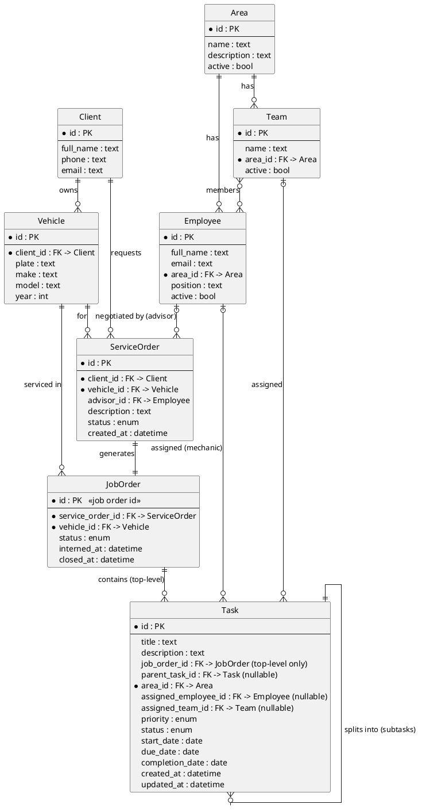

# Data Model

[← Back to README](../README.md)

This data model serves an [auto repair workshop](domain.md). It has two groups
of entities:

- **Front desk (Part 1):** `Client`, `Vehicle`, and `ServiceOrder` — the work
  negotiated with the client. Kept simple for now.
- **Workshop (Part 2, the focus):** `JobOrder` and the `Task` hierarchy, plus
  the people doing the work (`Area`, `Employee`, `Team`).

Key chain: a **Service Order** generates a **Job Order** (with a job order id);
the job order contains **top-level tasks** (the jobs to do, e.g. *Diagnostic*),
and each top-level task is **split into subtasks**. Every task is assigned to a
**mechanic (employee)** or a **team**.

## Entity relationship diagram

## Front-desk entities (Part 1)

> These are intentionally minimal for the first version — see [Domain](domain.md).

### Client

The vehicle owner. Can view the status of their vehicle online.

| Field     | Type | Notes |
| --------- | ---- | ----- |
| id        | PK   | |
| full_name | text | |
| phone     | text | |
| email     | text | Optional; used for the client status view |

### Vehicle

A car brought into the workshop.

| Field  | Type | Notes |
| ------ | ---- | ----- |
| id     | PK   | |
| client | FK → Client | Owner |
| plate  | text | License plate |
| make   | text | e.g. Toyota |
| model  | text | e.g. Corolla |
| year   | int  | |

### Service Order

What the advisor negotiates with the client.

| Field       | Type | Notes |
| ----------- | ---- | ----- |
| id          | PK   | |
| client      | FK → Client | |
| vehicle     | FK → Vehicle | |
| advisor     | FK → Employee (nullable) | Who negotiated it |
| description | text | What was agreed |
| status      | enum | e.g. Open / Approved / Closed |
| created_at  | datetime | |

## Workshop entities (Part 2)

### Job Order

Generated from a Service Order; carries the **job order id** that every
top-level task references. Represents the work on one interned vehicle.

| Field         | Type | Notes |
| ------------- | ---- | ----- |
| id            | PK   | **The job order id** |
| service_order | FK → ServiceOrder | The order that generated it |
| vehicle       | FK → Vehicle | The interned vehicle |
| status        | enum | e.g. Open / In progress / Done / Delivered |
| interned_at   | datetime | When the vehicle was checked in |
| closed_at     | datetime | When the work was finished |

> For now a Service Order generates **one** Job Order. This can be relaxed later
> if a single negotiation needs to spawn several job orders.

### Area

A work area of the shop (e.g. Mechanical, Bodywork, Paint, Electrical).

| Field       | Type | Notes |
| ----------- | ---- | ----- |
| id          | PK   | |
| name        | text | |
| description | text | |
| active      | bool | Inactive areas are hidden from new assignments |

### Employee

A worker — typically a **mechanic**, also advisors.

| Field     | Type | Notes |
| --------- | ---- | ----- |
| id        | PK   | |
| full_name | text | |
| email     | text | |
| area      | FK → Area | The area the employee belongs to |
| position  | text | Role or position (e.g. Mechanic, Advisor) |
| active    | bool | Only active employees can be assigned tasks |

### Team

A group of employees that can be assigned to a task together.

| Field   | Type | Notes |
| ------- | ---- | ----- |
| id      | PK   | |
| name    | text | |
| area    | FK → Area | |
| members | M2M → Employee | The employees in the team |
| active  | bool | |

### Task

A unit of work inside a job order. A **top-level task** is a "job to do" (e.g.
*Diagnostic*); its **subtasks** are the concrete steps.

| Field             | Type | Notes |
| ----------------- | ---- | ----- |
| id                | PK   | |
| title             | text | |
| description       | text | |
| job_order         | FK → JobOrder | **Required on top-level tasks**; empty on subtasks |
| parent_task       | FK → Task (nullable) | Set on subtasks; empty on top-level tasks |
| area              | FK → Area | |
| assigned_employee | FK → Employee (nullable) | Responsible mechanic |
| assigned_team     | FK → Team (nullable) | Responsible team |
| priority          | enum | Low / Medium / High / Critical |
| status            | enum | See [task lifecycle](workflows.md#task-lifecycle) |
| start_date        | date | |
| due_date          | date | |
| completion_date   | date | Set when status becomes Completed |
| created_at        | datetime | |
| updated_at        | datetime | |

## Subtasks

A task can be **divided into N subtasks** through the self-referential
`parent_task` relationship:

- A task with `parent_task = empty` is a **top-level task** and **must
  reference a `job_order`** (the job order id).
- A task with `parent_task` set is a **subtask** of that parent and **inherits**
  the parent's job order (it does not store its own `job_order`).
- A parent can have any number of subtasks. Subtasks are ordinary tasks, so
  they have their own assignee, priority, status, and dates.

Rules:

- To keep the model simple for non-technical users, the hierarchy is **one
  level deep** (a subtask cannot itself be split). This avoids confusing,
  deeply nested trees in the UI.
- A subtask's `area` defaults to the parent's area but can differ if the work
  belongs to another area.
- **Parent progress is derived from its subtasks** — see
  [Workflows → Subtask progress](workflows.md#subtask-progress-roll-up).

## Assignment: mechanic or team

A task is assigned to either an **employee (mechanic)** or a **team** — normally
the same mechanic handling the job order, but it can be any other mechanic or a
team. Exactly one of `assigned_employee` / `assigned_team` is set.

## Enumerations

- **Priority** — see [Features → Priority](features.md#priority).
- **Status** — see [Features → Status](features.md#status) and the
  [task lifecycle](workflows.md#task-lifecycle).

## Mapping to Django modules

Each entity is owned by a Django module under `src/`. Table names use the app
label, not the `src` package path — see [Architecture](architecture.md#database-table-naming).

| Entity        | Module           | Expected table        |
| ------------- | ---------------- | --------------------- |
| Client        | `src.clients`    | `clients_client`      |
| Vehicle       | `src.vehicles`   | `vehicles_vehicle`    |
| Service Order | `src.sales`      | `sales_serviceorder`  |
| Job Order     | `src.workshop`   | `workshop_joborder`   |
| Area          | `src.areas`      | `areas_area`          |
| Employee      | `src.employees`  | `employees_employee`  |
| Team          | `src.teams`      | `teams_team`          |
| Task          | `src.tasks`      | `tasks_task`          |
