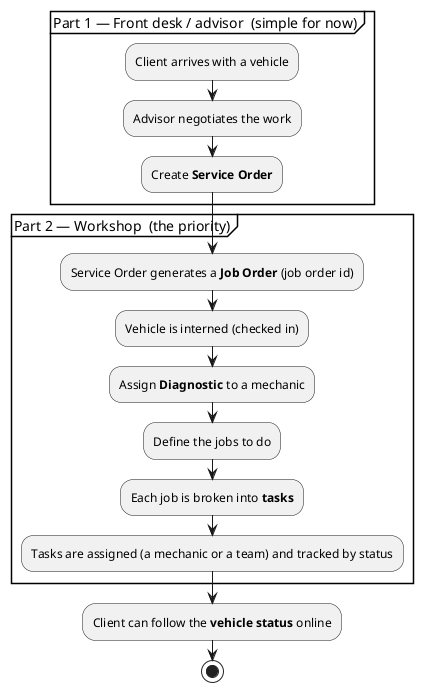

# Domain: Auto Repair Workshop

[← Back to README](../README.md)

This system is built for a **mechanic workshop** ("taller mecánico"). The work
splits into two parts. **Part 2 (the workshop) is the priority** for the first
version; Part 1 can start simple and be detailed later.

## The two parts

### Part 1 — Negotiation (front desk / advisor)

An advisor negotiates the work with the client and records what was agreed as a
**Service Order**. For now this can be a minimal screen — its detailed
implementation is considered future work.

### Part 2 — Workshop execution (the focus)

The Service Order **generates a Job Order**, which has its own **job order id**.
The vehicle is interned (checked in) and the work begins:

1. A **diagnostic** is assigned to one mechanic.
2. From the diagnostic, the **jobs to do** are defined.
3. Each job is broken into **tasks**, and each task is **assigned** — normally
   to the same mechanic, but it can be another mechanic or a **team**.
4. Tasks carry a **status**, so the shop always knows who is doing what and how
   far along each vehicle is.
5. The **client can join and see the status of their vehicle**.

## How it maps to the task hierarchy

The generic task model (a task that can be [split into subtasks](data-model.md#subtasks))
maps onto the workshop like this:

| Workshop concept | In the system |
| ---------------- | ------------- |
| Job order        | `JobOrder` (has the job order id) |
| A job to do (e.g. Diagnostic, Brake repair) | A **top-level task** — it carries the `job_order` reference |
| The concrete steps of that job | **Subtasks** of the top-level task |
| Who does it | The task's assigned **employee (mechanic)** or **team** |
| Progress | The task **status** ([lifecycle](workflows.md#task-lifecycle)) |

> **Rule:** every **top-level (parent) task belongs to a job order** — it must
> carry a job order id. Subtasks inherit the job order from their parent.

## Glossary

| Term (ES)          | Term (EN)        | Meaning |
| ------------------ | ---------------- | ------- |
| Orden de servicio  | Service Order    | What the advisor negotiates with the client (Part 1) |
| Orden de trabajo   | Job Order        | Generated from the service order; drives the workshop work (Part 2) |
| Diagnóstico        | Diagnostic       | First job, assigned to one mechanic |
| Mecánico           | Mechanic         | An employee who performs tasks |
| Cliente            | Client           | Vehicle owner; can view their vehicle's status |

## Related documents

- [Data Model](data-model.md) — entities and relationships.
- [Workflows](workflows.md) — the workshop flow and task lifecycle.
- [Features](features.md) — what each screen does.
