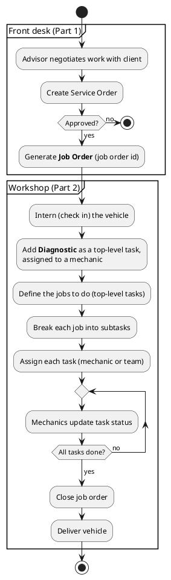
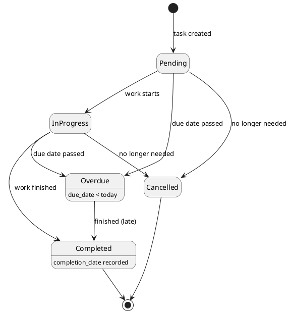
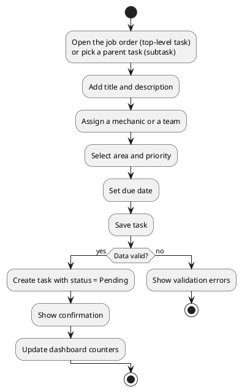
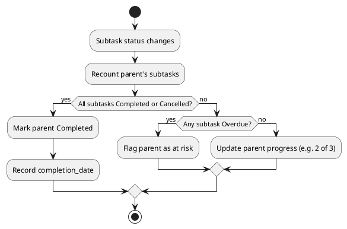
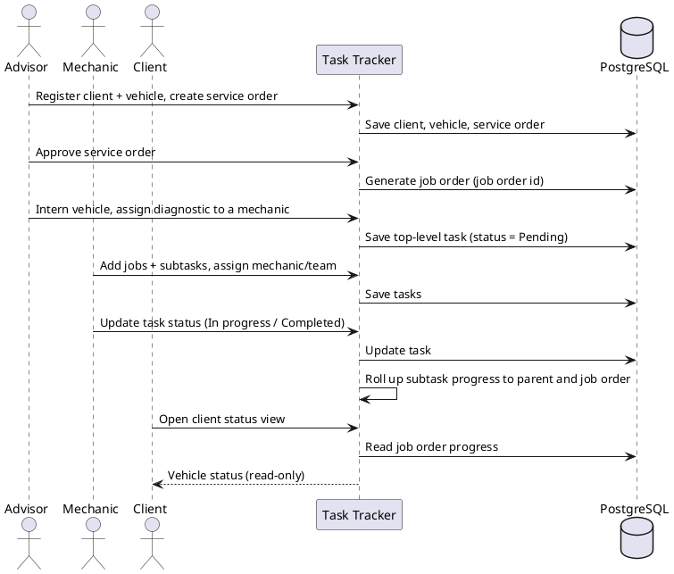

# Workflows

[← Back to README](../README.md)

This document describes how work moves through the [workshop](domain.md) over
time. For the static definitions of each entity and status, see
[Features](features.md) and the [Data Model](data-model.md).

## Workshop flow (service order → job order → tasks)

The end-to-end path of a vehicle through the shop:

The client can follow the vehicle's status throughout — see
[client status view](#client-status-view).

## Task lifecycle

A task is created as **Pending** and moves through its statuses as work
progresses. If the due date passes before completion, the system marks it as
**Overdue**. A task can be **Cancelled** at any point before completion.

## Creating a task

A user creates a task by entering its information. The task starts in the
**Pending** status.

## Assigning and completing a task

- A task is assigned to a **mechanic or a team**. They become responsible for
  completing it before the due date.
- The status is updated as work progresses
  (`Pending → In progress → Completed`).
- When finished, the responsible employee sets the status to **Completed**, and
  the system stores the completion date to determine whether it was on time or
  late.
- If the due date passes without completion, the system can mark the task as
  **Overdue**.

## Subtask progress roll-up

When a task is [split into subtasks](data-model.md#subtasks), the parent's
progress is derived from its children so the person in charge always sees an
honest picture without manual bookkeeping.

- The parent shows a count like **"2 of 3 done"** and a progress bar.
- A parent is considered **Completed** only when **all** its subtasks are
  Completed or Cancelled.
- If any subtask is **Overdue**, the parent is flagged as at risk.

## End-to-end user flow

The typical flow across roles, from intake to delivery:

## Related documents

- [Features](features.md) — definitions of statuses and priorities.
- [Reports](reports.md) — the outputs produced from this data.
- [Paradigms](paradigms.md) — how these flows map to the code's structure.
